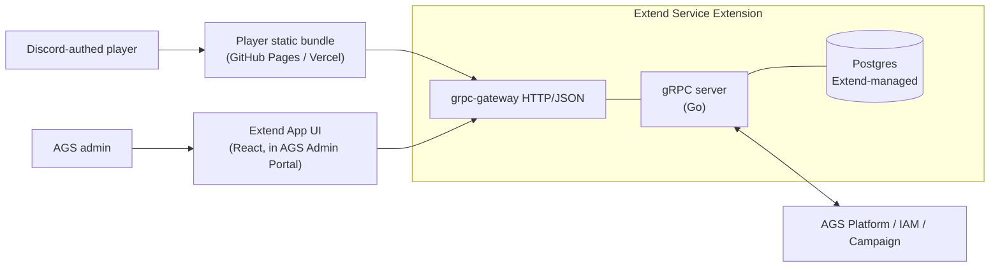

# playtesthub

> Self-hosted, MIT-licensed [AccelByte Gaming Services (AGS) Extend](https://docs.accelbyte.io/gaming-services/modules/foundations/extend/) application for running **closed game playtests** end-to-end.

Players apply for a slot, click-accept the NDA, get a code (Steam key or AGS Campaign), play, and fill out a survey. Admins curate signups, manage the code pool, and review structured feedback from inside the AGS Admin Portal.

Built for indie and mid-size studios that already use AGS and need tenant-isolated playtest tooling they can own, audit, and self-host inside their own namespace, without rebuilding the same signup → NDA → key → feedback plumbing every release.


- [What's in the box](#whats-in-the-box)
- [Quick start](#quick-start)
- [Try the full flow](#try-the-full-flow)
- [Feature deep-dives](#feature-deep-dives)
- [Architecture at a glance](#architecture-at-a-glance)
- [Deploy](#deploy)
- [Integrating with your game](#integrating-with-your-game)
- [Documentation](#documentation)
- [Development workflow](#development-workflow)
- [Contributing](#contributing)
- [License](#license)

## What's in the box

- **Three distribution models.** Every playtest picks one: `STEAM_KEYS` (CSV passthrough, manual Steam redemption), `AGS_CAMPAIGN` (in-game redemption via the AGS Platform Campaign API), or `ADT` (ships an AccelByte Development Toolkit build as a download URL, see [ADT distribution](#adt-distribution-m5b)). The two code-based models share one internal code pool and state machine.
- **Discord-federated player identity.** Players sign in with Discord through AGS IAM's platform-token grant, and the backend receives a real AGS user.
- **NDA versioning with forced re-acceptance.** Edit the NDA mid-playtest and approved players must accept the new version before they can submit a survey response.
- **Discord DM delivery of granted codes.** A FIFO worker queue with a circuit breaker, manual retry, and restart-sweep semantics. Approval succeeds even if the DM fails, and the code stays visible in the player UI. Note that Discord blocks bot DMs unless the bot and the applicant share a server, so you need a Discord server both join; see [`docs/runbooks/setup-ags-discord.md` § 7 "Discord bot + server"](docs/runbooks/setup-ags-discord.md#7-discord-bot--server-required-for-dm-delivery).
- **Playtest window enforcement.** A background worker automatically opens the playtest at `startsAt` and closes it at `endsAt`. See [Window enforcement](#window-enforcement-m4).
- **Auto-approve.** The first N signups get approved instantly, skipping manual triage. See [Auto-approve](#auto-approve-m5a).
- **Versioned typed surveys** (text, 1–5 rating, multi-choice), with responses split per survey version.
- **Per-action audit log.** Every admin mutation is recorded, with stable JSONB payload shapes.
- **Admin detail page + bulk announcements.** A list + detail-page-with-tabs admin UI, plus admin-authored broadcast DMs. See [UX revamp](#ux-revamp-m5c).
- **TDD-first.** Unit, integration (testcontainers Postgres), e2e golden flow, and a smoke harness (the `pth` CLI). CI enforces every gate on every PR.



## Quick start

### Prerequisites

- Linux / macOS / WSL2; Bash; Docker 23+; Go 1.25; Node 22+; `protoc`, `grpcurl`, `jq`, `curl`.
- An AGS namespace and a confidential IAM client (PRD §5.9). [`docs/runbooks/setup-ags-discord.md`](docs/runbooks/setup-ags-discord.md) walks the AGS-side setup.

### Boot the backend

```bash
git clone https://github.com/anggorodewanto/playtesthub.git
cd playtesthub

cp .env.template .env
# Fill AGS_BASE_URL, AGS_NAMESPACE, AGS_IAM_CLIENT_ID, AGS_IAM_CLIENT_SECRET,
# DISCORD_BOT_TOKEN. DATABASE_URL + BASE_PATH already have local-dev defaults.

docker compose up --build       # backend + Postgres
```

Smoke check:

```bash
./scripts/smoke/boot.sh         # ephemeral PG + backend boot + reflection probe
```

## Try the full flow

The `pth` CLI is the canonical end-to-end harness. It is the same surface a human (or an AI agent) uses to drive the system, and the same path the e2e tests exercise. The composite command **`pth flow golden-m3`** runs the whole golden flow and emits one NDJSON line per step:

1. Admin creates an NDA-required `STEAM_KEYS` playtest
2. Admin publishes it
3. Player signs up
4. Player accepts the NDA
5. Admin uploads Steam keys
6. Admin approves the player
7. Player retrieves the granted code
8. Admin authors a survey
9. Player submits a response
10. Admin lists the responses

```bash
go build -o pth ./cmd/pth

# Profile A — admin (used to create + publish the playtest, upload keys, approve, author survey, list responses).
export PTH_AGS_BASE_URL=https://your-namespace.gamingservices.accelbyte.io
export PTH_IAM_CLIENT_ID=<confidential-iam-client-id>
export PTH_IAM_CLIENT_SECRET=<confidential-iam-client-secret>
export PTH_BACKEND=localhost:6565

./pth --profile admin auth login --password \
  --namespace your-namespace --username admin@example.com

# Profile B — player (created on the fly via the AGS test-user-group endpoint).
read -r USER_ID USERNAME PASSWORD < <(./pth user create --json | jq -r '[.userId,.username,.password] | @tsv')
echo "$PASSWORD" | ./pth --profile "player-$USER_ID" user login-as \
  --user-id "$USER_ID" --username "$USERNAME" --password-stdin

# Drive the golden flow. --codes-count synthesises a STEAM key for the upload step;
# pass --codes-file <path> to supply a real CSV instead. The flow seeds a TEXT +
# RATING survey question pair inline — no --from path needed.
./pth flow golden-m3 \
  --slug "demo-$(date +%s)" \
  --admin-profile admin \
  --player-profile "player-$USER_ID"
```

Expected output is ten NDJSON lines, all `status=OK`:

```json
{"step":"create-playtest","status":"OK","response":{"playtest":{"id":"…","status":"PLAYTEST_STATUS_DRAFT","nda_required":true}}}
{"step":"transition-open","status":"OK","response":{"playtest":{"status":"PLAYTEST_STATUS_OPEN"}}}
{"step":"signup","status":"OK","response":{"applicant":{"id":"…","status":"APPLICANT_STATUS_PENDING"}}}
{"step":"accept-nda","status":"OK","response":{"acceptance":{"nda_version_hash":"…"}}}
{"step":"upload-codes","status":"OK","response":{"accepted":1,"rejected":0}}
{"step":"approve","status":"OK","response":{"applicant":{"status":"APPLICANT_STATUS_APPROVED"}}}
{"step":"get-code","status":"OK","response":{"value":"GOLDEN-M2-DEMO-…","distribution_model":"DISTRIBUTION_MODEL_STEAM_KEYS"}}
{"step":"create-survey","status":"OK","response":{"survey":{"id":"…","version":1,"questions":[{"id":"…","type":"SURVEY_QUESTION_TYPE_TEXT"},{"id":"…","type":"SURVEY_QUESTION_TYPE_RATING"}]}}}
{"step":"submit-response","status":"OK","response":{"response":{"id":"…","submitted_at":"…"}}}
{"step":"list-responses","status":"OK","response":{"responses":[{"id":"…","answers":[…]}]}}
```

Tear down:

```bash
./pth playtest delete --slug "demo-..." --yes
./pth user delete --user-id "$USER_ID" --yes
```

The tests under [`e2e/golden_m1_test.go`](e2e/golden_m1_test.go), [`e2e/golden_m2_test.go`](e2e/golden_m2_test.go), [`e2e/golden_m3_test.go`](e2e/golden_m3_test.go), and [`e2e/golden_m4_test.go`](e2e/golden_m4_test.go) wrap the same sequences behind `go test ./e2e/...` for CI and operator verification. See [`docs/cli.md` §7.4](docs/cli.md).

## Feature deep-dives

### Window enforcement (M4)

`Playtest.startsAt` and `Playtest.endsAt` are enforced, not display-only: a background worker opens and closes the playtest on schedule.

<details>
<summary>Details</summary>

- A background `internal/window/` worker auto-transitions `DRAFT → OPEN` at `startsAt` and `OPEN → CLOSED` at `endsAt` (PRD §5.1, [`docs/STATUS_M4.md`](docs/STATUS_M4.md)).
- `pth flow golden-m4 --slug e2e-m4 --admin-profile admin` exercises the path. It creates a playtest with a window, waits for the auto-open and auto-close, then asserts that two system-attributed `playtest.status_transition` audit rows exist.

</details>

### Auto-approve (M5.A)

Set `autoApprove=true` and `autoApproveLimit=N` (1..100,000) on a playtest, and the first `N` signups are approved straight from the signup handler instead of waiting in the manual triage queue (PRD §5.4, [`docs/STATUS_M5.md`](docs/STATUS_M5.md)).

<details>
<summary>Details</summary>

- Works with every distribution model: STEAM_KEYS, AGS_CAMPAIGN, and ADT.
- The cap bounds auto-approvals only. Manual `ApproveApplicant` against PENDING applicants stays uncapped.
- If the code pool runs empty during a signup burst, the signup still succeeds and the applicant quietly lands in PENDING. The operator restocks the pool (or approves manually) later; the applicant never sees an error.
- `pth flow golden-m2 --slug "auto-$(date +%s)" --admin-profile admin --player-profile "player-$USER_ID" --auto-approve --auto-approve-limit 5` runs the variant. It prints the same seven NDJSON lines, with two differences: `upload-codes` moves before `signup` (auto-approve consumes from the pool inside the signup transaction), and the manual `approve` step is replaced by `assert-applicant-auto-approved`, which calls `ListApplicants` and checks that the just-signed-up row has `status=APPROVED` and `auto_approved=true`.

</details>

### ADT distribution (M5.B)

A third `distributionModel`, `ADT`, ships an AccelByte Development Toolkit build as a download URL instead of a redemption code (PRD §4.8, [`docs/STATUS_M5.md`](docs/STATUS_M5.md), runbook in [`docs/runbooks/adt-linking.md`](docs/runbooks/adt-linking.md)).

<details>
<summary>Details</summary>

- One-time setup per studio: an admin links the studio's ADT namespace via the **Link new ADT Namespace** button on the Playtests list page. The link is a state-bearing redirect to ADT; no credential is exchanged, and subsequent ADT API calls authenticate with playtesthub's AGS service IAM JWT.
- Each playtest then picks an ADT namespace, game, and build at create time.
- On approve, the backend resolves a download URL via `adt.Client.IssueDownloadURL` (per build, with a fixed 24-hour CDN TTL per the 2026-05-20 ADT spec). If ADT is unavailable, it falls back to the playtest's static `adtFallbackDownloadUrl`. The DM body embeds the URL.
- On the player side, the Pending page renders a download card instead of a code panel for ADT playtests, backed by the `GetADTDownloadInfo` RPC.
- CLI surface: `pth adt linkage {list,start,complete,unlink}`, `pth adt build list`, and `pth flow golden-m5 --slug … --dry-run` for the 11-step request-shape catalogue.

</details>

### UX revamp (M5.C)

The admin shell moves from a list+modal layout to a list plus a detail page with tabs (PRD §5.7 M5.C restructure, [`docs/STATUS_M5.md`](docs/STATUS_M5.md), tour in [`docs/runbooks/admin-shell-tour.md`](docs/runbooks/admin-shell-tour.md)).

<details>
<summary>Details</summary>

- Clicking a row's **View** button navigates to `/playtest/<slug>`. The header carries the breadcrumb, title, date range, status pill, and the **Publish** / **Stop Playtest** verbs. Those verbs are pure copy renames over M4's existing state machine; PRD §5.1 is unchanged.
- Four tabs sit below the header:
  - *Playtest Info*: read-only summary plus Edit.
  - *Distribution*: per-model rendering with a shared empty-state scaffold.
  - *Participants*: a 6-column table. Code Sent Date is derived from `applicant.last_dm_attempt_at`; four ADT telemetry cache columns ship dormant until M6.
  - *Discord Bot Tools*: admin-authored bulk DM broadcast. Subject and message are PII-sensitive and never logged. Runbook in [`docs/runbooks/announcement-broadcast.md`](docs/runbooks/announcement-broadcast.md).
- CLI surface: `pth announcement {create,list}` ships the broadcast tooling outside the admin UI.

</details>

## Architecture at a glance

- **Backend**: Go, gRPC + grpc-gateway in-process, Postgres (Extend-managed), `pgx` driver, `golang-migrate` migrations, `accelbyte-go-sdk` for IAM + Platform.
- **Player frontend**: Svelte 5 + Vite + Tailwind v4, static bundle, hash router. Discord login via AGS's platform-token grant ([`docs/engineering.md` §"Discord federation via platform-token grant"](docs/engineering.md)).
- **Admin frontend**: React 19 + TypeScript Extend App UI bundled as a Module Federation remote, hosted by AccelByte and rendered inside the AGS Admin Portal. Currently Internal-Shared-Cloud only ([PRD §9 R11](docs/PRD.md)).
- **CLI (`pth`)**: Go binary, talks gRPC directly on `:6565`. Authoritative end-to-end harness. Spec in [`docs/cli.md`](docs/cli.md).

Repo layout is documented in [`docs/engineering.md` §2](docs/engineering.md#2-repo-layout).

### Admin authorization

Every admin RPC is gated on the built-in AGS IAM permission `ADMIN:NAMESPACE:{namespace}:EXTEND:APPUI` (the App UI admin permission), checked at a per-RPC action bit (CREATE / READ / UPDATE / DELETE).

- That permission is held by namespace-admin roles like **Game Admin** and **Studio Admin**, which studios already assign to their admin staff. To authorize a playtest admin, assign one of those roles in the AGS Admin Portal.
- No custom role creation is required. This is what makes the app work on Shared Cloud, where game admins cannot assign `CUSTOM:*` permissions.
- The `AuditLog` provides per-action attribution.

See [PRD §6 AuthZ](docs/PRD.md#security) and [PRD §9 R8](docs/PRD.md).

## Deploy

Three deployable surfaces. Each has its own host and its own runbook.

1. **Backend (Extend Service Extension)**: Go binary + Postgres on AGS Extend.
   1. Create the Extend Service Extension app in the AGS Admin Portal. Set the env vars and secrets per [PRD §5.9](docs/PRD.md#59-runtime-configuration-go-backend), including `CORS_ALLOWED_ORIGINS` if the player will be hosted off-origin.
   2. Build + push with [`extend-helper-cli`](https://github.com/AccelByte/extend-helper-cli):
      ```bash
      extend-helper-cli image-upload --login \
        --namespace <namespace> --app <app-name> --image-tag v0.0.1
      ```
   3. Deploy the pushed image from **App Detail → Image Version History → Deploy**, or via `extend-helper-cli deploy-app --wait`.
2. **Player frontend (Svelte → GitHub Pages)**: static bundle, hash-routed, Discord-federated. Auto-deploys on push to `main` via [`.github/workflows/pages.yml`](.github/workflows/pages.yml). Setup is one-time per fork: enable Pages with the workflow build source, set three repo Variables, allowlist the Pages origin in the backend's `CORS_ALLOWED_ORIGINS`, and register the Pages callback URL with Discord + AGS. Walk-through in [`docs/runbooks/deploy-player-pages.md`](docs/runbooks/deploy-player-pages.md). Vercel + custom-domain variants are noted in that runbook's § Out of scope.
3. **Admin UI (Extend App UI)**: React Module Federation remote hosted by AccelByte. `extend-helper-cli appui create` + `appui upload` (Internal Shared Cloud only today, see [`docs/engineering.md` §8](docs/engineering.md#8-temporary-ags-platform-workarounds)).

For first-time AGS + Discord setup (IAM client, platform credential, redirect URIs), follow [`docs/runbooks/setup-ags-discord.md`](docs/runbooks/setup-ags-discord.md) before any of the above.

## Integrating with your game

playtesthub identifies players by their **Discord-federated** AGS user; the game probably identifies them by their **Steam-federated** AGS user. AGS IAM treats those as two separate headless accounts, so the same human ends up with two different AGS userIds unless the integration explicitly bridges them. [`docs/game-integration.md`](docs/game-integration.md) covers the four patterns a game team can pick from. The recommended path is a one-time Discord-OAuth gate on first launch that links Steam onto the playtesthub-side account.

## Documentation

**v1.0.0 shipped (MIT).** Track progress in [`docs/STATUS.md`](docs/STATUS.md). Sources of truth, in order:

| Doc | What it owns |
| --- | --- |
| [`docs/PRD.md`](docs/PRD.md) | Behavior. Authoritative if anything else disagrees. |
| [`docs/schema.md`](docs/schema.md) | DB schemas, audit-log enum + JSONB shapes, fenced-finalize SQL. |
| [`docs/errors.md`](docs/errors.md) | Byte-exact gRPC error codes / messages. |
| [`docs/architecture.md`](docs/architecture.md) | Stack + external dependency detail. |
| [`docs/engineering.md`](docs/engineering.md) | Repo layout, test strategy, TDD workflow, CI gates. |
| [`docs/cli.md`](docs/cli.md) | `pth` CLI spec — surface for humans + AI to drive the app end-to-end. |
| [`docs/dm-queue.md`](docs/dm-queue.md) | DM worker FIFO, circuit breaker, restart sweep. |
| [`docs/ags-failure-modes.md`](docs/ags-failure-modes.md) | AGS retry policy, cleanup matrix, M2 sub-cap rules. |
| [`docs/game-integration.md`](docs/game-integration.md) | Bridging playtesthub's Discord-headless AGS user to the game's Steam-headless AGS user. |

## Development workflow

This repo is **TDD-first**. Every production change follows red → green → refactor:

1. Write a failing test that names the behavior.
2. Write the minimum code to pass.
3. Refactor with tests green.

The smoke harness lands with the code that introduces it. See [`CLAUDE.md`](CLAUDE.md) and [`docs/engineering.md` §4](docs/engineering.md#4-redgreen-tdd-loop).

### Verification before committing

```bash
go test ./...                           # unit + integration (testcontainers-postgres)
golangci-lint run
buf lint
./proto.sh && git diff --exit-code      # proto stubs in sync
./scripts/smoke/boot.sh                 # backend boots + RPCs reach handlers
./pth flow golden-m3 ...                # canonical e2e (once env is configured)

# Frontend
( cd player && npm test && npm run build )
( cd admin  && npm test && npm run build )
```

CI runs the same gates on every PR; see [`.github/workflows/ci.yml`](.github/workflows/ci.yml). Browser-based a11y (`@axe-core/playwright` per [`docs/engineering.md` §5](docs/engineering.md#5-ci-gates)) is tracked under STATUS phase 12.1.

## Contributing

Issues and PRs welcome. Before opening one:

- Read [`CLAUDE.md`](CLAUDE.md) and [`docs/engineering.md`](docs/engineering.md); they encode the conventions CI enforces.
- Add a failing test before the fix. PRs that change behavior without a test will be sent back.
- For PRD-shaping proposals, file an issue first. The PRD is authoritative, and changes there gate everything else.

## License

MIT — see [`LICENSE`](LICENSE).
